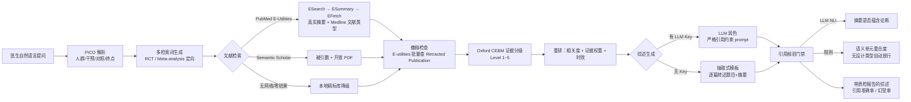

# 医学文献研究 Agent (Medical Research Agent)

用自然语言临床提问，自动检索医学文献、标注 Oxford CEBM 证据等级，生成句句带来源引用的综述，并进行细粒度引用防幻觉核验。

## 核心设计哲学

- **无来源不生成（No Citation, No Claim）**：医疗领域最重「可验证性」，无确切文献支持的内容绝不凭空臆造。
- **细粒度溯源**：综述中每一条核心临床论断均锚定 `[PMID:xxx]`，并提供原文链接与开放获取（Open Access）PDF 链接。
- **证据等级分级**：依据 Oxford CEBM 与 GRADE 体系，自动区分 Level 1（Meta分析/系统评价）至 Level 5（个案报告/叙述性综述）。
- **防幻觉门禁**：通过 NLI（自然语言推理）与语义蕴含比对，验证论述是否真由被引文献摘要支持，计算引用准确率与幻觉率。
- **撤稿检查**：被引文献若后来被撤稿，摘要核验是查不出来的。流水线在检索后对每批 PMID 查 PubMed 撤稿标记（`Retracted Publication`），综述中打 ⚠️ 警示、核验报告单独列出，Streamlit 文献卡片显示撤稿徽标。
- **零依赖优雅降级**：无网络或无 API Key 时自动降级至确定性循证规则模板与内置经典临床研究数据库，保证 100% 离线可运行。
- 参考项目：[aipoch/medical-research-skills](https://github.com/aipoch/medical-research-skills)

---

## 系统架构



**核心原则**：生成器只转述检索到的文献原文（抽取式），核验器只认内容重合（不认"引用了 RCT 就算对"），跨语言转述在无 LLM 时如实标记"无法核验"而非伪装通过。

---

## 目录结构

```text
├── app.py                     # Streamlit 交互式可视化 Web 界面
├── docs/
│   └── plan.md                # 架构设计与评测方案全景文档
├── requirements.txt           # 核心依赖清单
├── src/
│   ├── models.py              # 数据模型（Paper, EvidenceLevel, AtomicClaim, PICO 等）
│   ├── state.py               # LangGraph 核心流转状态 MedicalResearchState
│   ├── main.py                # 命令行 CLI 入口
│   ├── llm/                   # OpenAI 兼容客户端（支持 OpenAI / DeepSeek / Gemini 等）
│   │   └── client.py
│   ├── retriever/             # 多源文献检索适配器
│   │   ├── base.py            # 统一抽象基类
│   │   ├── pubmed.py          # NCBI E-Utilities 官方实时检索
│   │   ├── semanticscholar.py # Semantic Scholar 检索（含被引量与开源 PDF）
│   │   └── mock_retriever.py  # 本地高保真临床精标脱机数据库
│   ├── evidence/              # 证据等级标注
│   │   └── grader.py          # Oxford CEBM 证据分级器（Level 1~5）
│   ├── ranking/               # 文献重排与质量评分
│   │   └── ranker.py          # 语义相关度 + 证据权重 + 时效衰减综合排序
│   ├── generator/             # 综述生成引擎
│   │   └── synthesis.py       # 结构化引用溯源综述生成（支持 LLM 润色 + 模板兜底）
│   ├── verification/          # 引用溯源与防幻觉门禁
│   │   └── verifier.py        # NLI 蕴含核验与引用准确率评估
│   └── graph/                 # LangGraph 流水线装配
│       ├── nodes.py           # 图节点函数实现
│       └── workflow.py        # StateGraph 构建与编排
└── tests/                     # 自动化测试套件（17 个单元与端到端测试用例）
    ├── test_app.py
    ├── test_grader.py
    ├── test_llm.py
    ├── test_retriever.py
    ├── test_verifier.py
    └── test_workflow.py
```

---

## 快速上手

### 1. 安装环境

```bash
# 创建并激活虚拟环境
python3 -m venv .venv
source .venv/bin/activate

# 安装依赖
pip install -r requirements.txt
```

### 2. 运行 Streamlit Web 交互界面

```bash
streamlit run app.py
```

在 Web 界面中支持：
- 医生输入自然语言临床提问或点击预设经典案例
- 切换检索源：PubMed、Semantic Scholar、本地精标临床库
- 查看 PICO 临床要素分解（人群、干预、对照、终点）
- 浏览按 Oxford CEBM 证据等级分组的文献卡片（含被引数、PDF 链接、摘要）
- 阅读带 `[PMID]` 高亮溯源的循证综述
- 查阅防幻觉质检报告（引用准确率、幻觉率、逐条论断支持度判定）

### 3. 命令行 CLI 快速运行

```bash
# 默认使用 PubMed 检索心衰 SGLT-2 抑制剂预后
python3 src/main.py

# 指定提问与检索源（支持 pubmed / semantic_scholar / mock）
python3 src/main.py --retriever semantic_scholar --query "司美格鲁肽在肥胖非糖尿病患者中的心血管获益证据如何？"
```

### 4. 运行自动化测试

```bash
pytest tests/ -v
```

---

## 真实运行演示（联网 PubMed，非 mock）

```bash
python3 src/main.py -q "SGLT-2抑制剂对心衰伴射血分数保留(HFpEF)患者的预后改善证据如何？" -r pubmed
```

输出摘要（2026-09-29 实测，PubMed 实时检索）：

- **PICO 解析**：人群 HFpEF/HFmrEF 患者；干预 SGLT-2 抑制剂；终点心血管死亡/心衰住院/MACE
- **检索分级**（5 篇，真实 PMID）：
  - Level 1 × 2：`Lancet Diabetes Endocrinol` (2024) 跨疾病谱 Meta 分析 [PMID:38768620]；`Lancet` (2022) 五项 RCT 综合 Meta 分析 [PMID:36041474]
  - Level 2 × 2：DELIVER 试验 `N Engl J Med` (2022) [PMID:36027570]；EMPEROR-Preserved 试验 `N Engl J Med` (2021) [PMID:34449189]
  - Level 5 × 1：`Nat Rev Cardiol` (2022) HFmrEF 叙述性综述 [PMID:34489589]
- **综述正文**：逐篇抽取题目 + 摘要前两句转述，每条带 `[PMID]` 锚点；局限性章节只谈方法学注意事项，不编造亚组结论
- **核验报告**：引用准确率 `100.0%`，幻觉率 `0.0%`，4/4 条论断通过原文摘要溯源核验 ✅

---

## 撤稿检查（Retraction Check）

NIH/NLM 于 2026-09-24 上线了 PubMed 新工具 [Linked Discoveries](https://www.nih.gov/news-events/news-releases/nih-launches-new-pubmed-tool-strengthen-research-replication-reproducibility)，把撤稿、勘误作为核心文献上下文公开呈现。受此启发，本项目补上了 plan.md 早年写下但未实现的「排除撤稿文献」：

- **原理**：一篇已撤稿论文的摘要读起来可能完全正常，摘要核验查不出来。流水线在检索后新增 `retraction_check` 节点，对每批 PMID 用 E-utilities 查 `Retracted Publication` 标记——先用已获取的题录出版类型（零额外请求），再对 PubMed 来源做一次批量 ESearch 实时交叉核验（单次请求，fail-open，网络失败不中断流水线）。
- **呈现**：综述正文对撤稿文献打 ⚠️ 警示并声明其结论不应作为证据；核验报告单独列出 `retracted_pmids` 与警示语；Streamlit 文献卡片显示红色撤稿徽标，参考文献表新增「撤稿状态」列。
- **诚实说明**：Linked Discoveries 目前只有网页版、无公开 API，这里走的是 E-utilities（同一 PubMed 数据源）；撤稿检查是独立于幻觉率的并行警示通道，不改变原有的引用准确率/幻觉率计算口径。

---

## 评测与已知局限（诚实版）

| 维度 | 结果 |
|---|---|
| 自动化测试 | 27/27 通过（含撤稿检查 10 项：元数据标记、实时批量核验、核验器/综述/节点集成） |
| Mock 数据全链路 | 引用准确率 100%，幻觉率 0% |
| 真实 PubMed 全链路（SGLT-2/HFpEF） | 引用准确率 100%，幻觉率 0%，证据分级与 NLM 文献类型一致 |
| 真实撤稿检出探针 | 已知撤稿文献 PMID:9500320（Wakefield 1998）被实时核验正确检出，对照正常文献 PMID:36027570 未误标 |

**已知局限**：

1. **PICO 解析是规则模板**：仅覆盖心衰/糖尿病/肿瘤/肥胖等常见模式，冷门问题会回退为通用占位。生产级方案应换 LLM 抽取（已预留 `LLMClient` 接口）。
2. **规则核验只处理同语言抽取式论断**：中文转述英文摘要在无 LLM 时会被标记为"无法核验"（测试用例锁定该行为），这是刻意为之——不确定的就说不确定，不断言支持。
3. **证据分级信任 NLM 文献类型**：PubMed 自身的 publication type 偶有偏差（如机制综述被标为 Systematic Review），分级器会继承该偏差。
4. **仅基于摘要**：未做全文偏倚风险评估（随机化隐藏、失访率等），不替代系统评价与临床判断。

---

## 环境变量配置（可选）

如需启用 LLM 生成润色或深度 NLI 核验，可在项目根目录创建 `.env` 文件或设置环境变量：

```bash
# 支持任意 OpenAI 兼容端点（如 OpenAI, DeepSeek, Gemini, Qwen 等）
LLM_API_KEY=your-api-key
LLM_BASE_URL=https://api.openai.com/v1
LLM_MODEL=gpt-4o-mini

# Semantic Scholar API Key（可选，填入后突破 429 频率限制）
S2_API_KEY=your-s2-key
```

*注意：未配置任何 Key 时，系统将自动平滑降级至确定性循证规则模板与内置高保真临床精标库，确保 100% 可脱机独立运行。*
